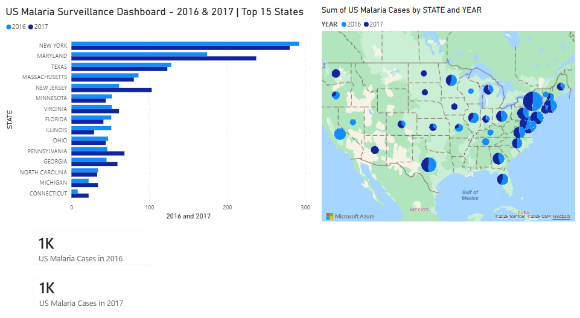
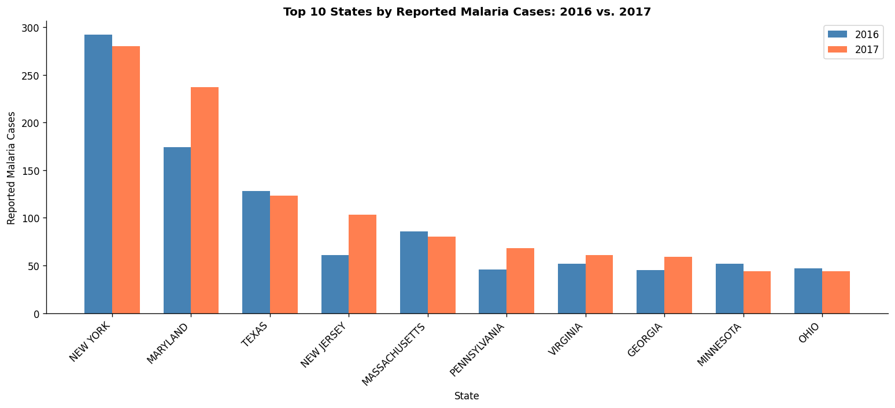
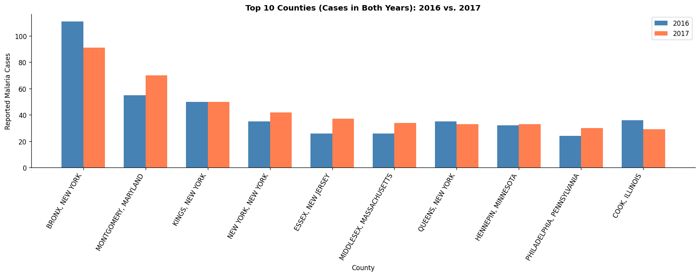

# US Malaria Surveillance - Exploratory Data Analysis
### State and County-Level Distribution | 2016 vs. 2017

*Data Analytics Portfolio Project · Python · Power BI · Epidemiological Surveillance*

---

## Overview

Malaria cases reported in the United States are almost exclusively travel-associated, making their geographic distribution a reflection of international travel patterns, access to healthcare, and diagnostic infrastructure. This project uses CDC county-level surveillance data to identify which states and counties reported the highest malaria burden in 2016 and 2017, and quantifies year-over-year changes in reported cases.

Python was used for data cleaning, aggregation, and exploratory analysis. Power BI was used to build an interactive dashboard for geographic visualization and dynamic filtering.

---

## Objectives

1. Identify states and counties with the highest reported malaria burden in 2016 and 2017;
2. Compare disease distribution between both years at state and county level;
3. Quantify absolute and relative year-over-year changes to detect emerging trends;
4. Flag data quality considerations across years;
5. Deliver an interactive dashboard for exploratory surveillance analysis.

---

## Tools & Stack

| Layer | Tool |
|---|---|
| Data cleaning & analysis | Python (pandas, matplotlib, numpy) |
| Notebook environment | Jupyter Notebook / Google Colab |
| Database querying | SQL (SQLite) |
| Interactive visualization | Power BI |

---

## Data Source

**Centers for Disease Control and Prevention (CDC)** - Number of Reported Malaria Cases by County, United States (2016 & 2017).

---

## Key Insights

| # | Finding |
|---|---|
 | 1 | **Concentrated burden:** New York (280 cases), Maryland (237), and Texas (123) account for the vast majority of U.S. malaria cases, reflecting geographic clustering around major urban and international travel hubs. |
 | 2 | **Year-over-year shift:** Maryland (+63) and New Jersey (+42) drove most of the national net gain of +97 cases, while Connecticut (+175%), Kansas (+120%), and Indiana (+80%) recorded the largest relative increases despite low baselines, reinforcing that growing burden is not exclusive to the highest-volume states. |
 | 3 | **County-level concentration:** Within high-burden states, cases concentrate heavily in one or two counties. Four of the top 10 counties nationally are in New York State alone (Bronx, Kings, New York, Queens), with the Bronx leading at 91 cases in 2017. |
 | 4 | **Data coverage gaps:** Not all states appear in both years, which limits direct year-over-year comparisons. Analysis was restricted to common states to ensure comparability. |
 | 5 | **Travel-associated context:** U.S. malaria cases are almost exclusively imported. Geographic patterns, concentrated in states like New York, Maryland, and Texas, likely reflect international travel routes, immigration corridors, and access to diagnostic services rather than local transmission.

---

## Dashboard Preview

*Figure 1. Interactive Power BI dashboard showing malaria case distribution across U.S. states (2016–2017).*
---

*Figure 2. Comparative spatial distribution of the Top 10 U.S. states reporting malaria, ranked by number of cases.*
---

*Figure 3. Comparative spatial distribution of the Top 10 U.S. counties reporting malaria, ranked by number of cases.*
---
---

## Analytical Approach

- Loaded and standardized raw CDC CSV datasets (2016 and 2017);
- Renamed and unified case columns; added year identifier;
- Combined datasets into a single long-format table for analysis;
- Performed data quality checks: identified states present in only one year;
- Aggregated cases at state and county level for both years;
- Calculated absolute and relative year-over-year change;
- Filtered analysis to states present in both years for valid comparisons;
- Exported clean wide and long-format datasets for Power BI dashboard development.

---

## Notebook

[View the full Python analysis →](notebooks/malaria_analysis.ipynb)

---

## Author

**Dr. Maria Julia Judson, DVM, MSc**  
Wildlife Veterinarian · Data Analyst · PhD Student in Health Technology

*Open to data analytics roles in public health, epidemiology, biotech, and health technology.*
